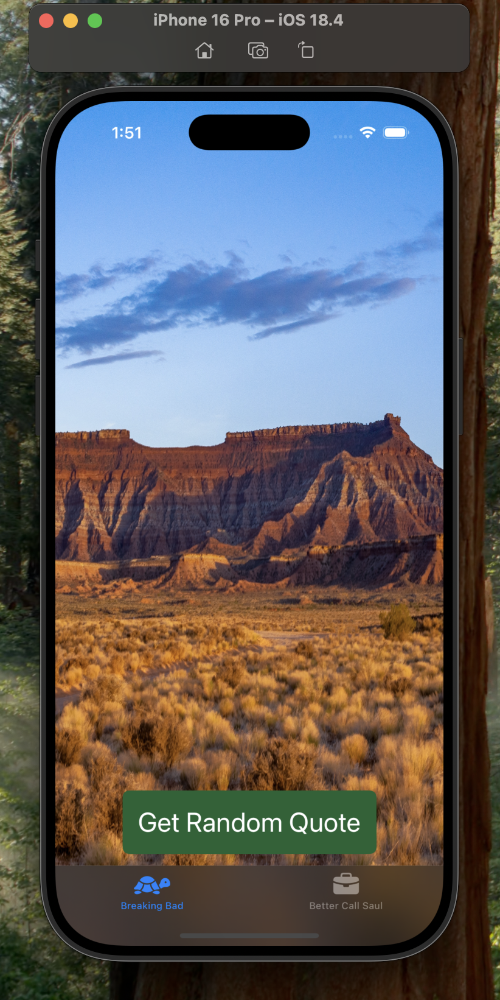
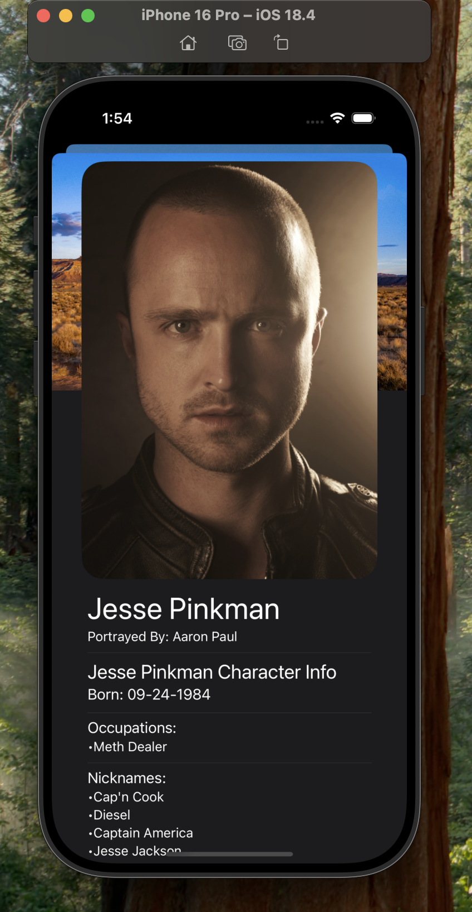
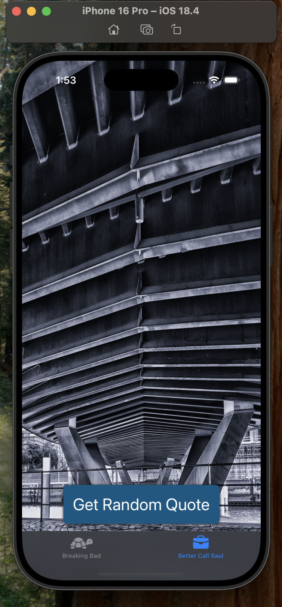
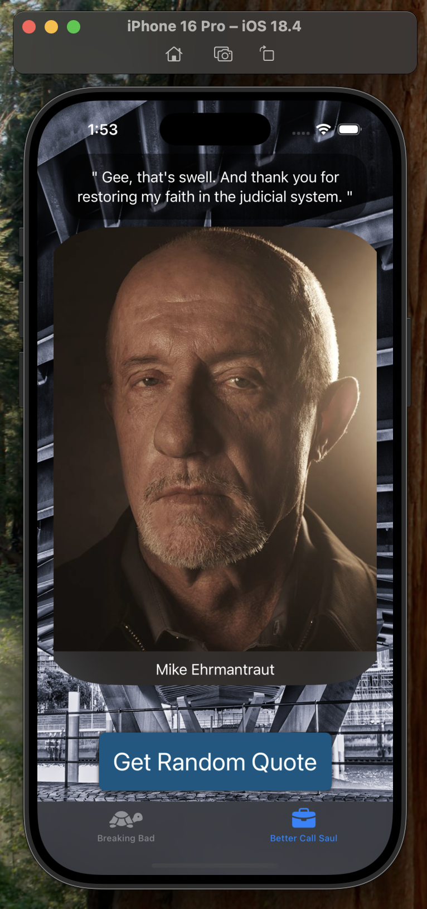
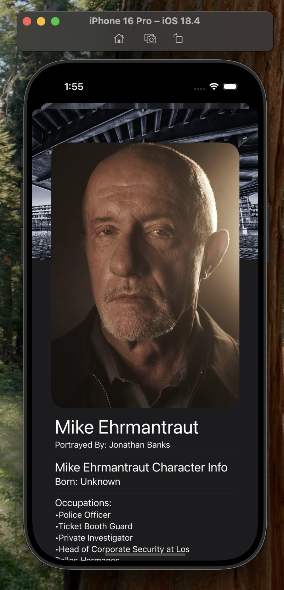
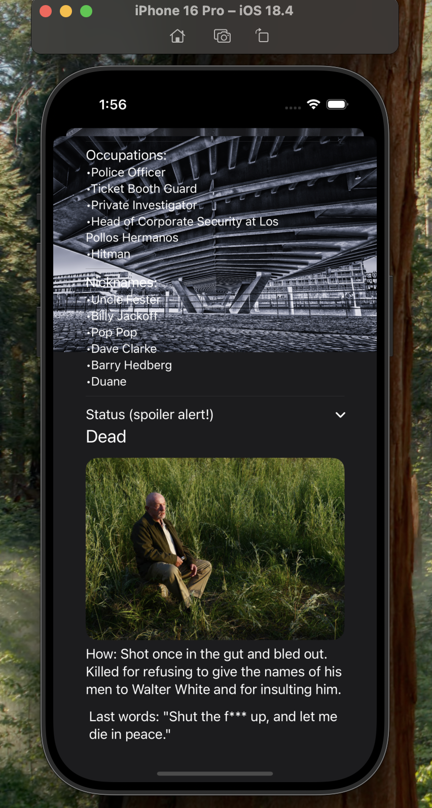

# 💣 Breaking Bad Quotes

**Breaking Bad Quotes** is a SwiftUI app that fetches random quotes and character information from the Breaking Bad universe using asynchronous networking. It leverages async/await, MVVM architecture, and custom JSON decoding for a responsive, dynamic user experience.

---

## ✨ Features

- 🔄 **Fetch random quotes** from Breaking Bad and Better Call Saul
- 🌐 Networking with **async/await** for smooth data loading
- 🧵 Swift concurrency using `Task` and structured async functions
- 📂 **MVVM Architecture** for data separation and state management
- 🧑‍💻 **Character Detail View** with status, images, and last words (spoilers)
- 🎨 **Custom Color Scheme** based on show themes
- 📝 **DisclosureGroup** for spoiler content (character death info)
- 🚀 Programmatic scrolling using `ScrollViewReader`
- 📱 Fully SwiftUI-native with dark mode optimization

---

## 🛠 Technologies Used

- **Swift 6**
- **SwiftUI**
- **Combine** (for data handling and state management)
- **Async/Await** for networking
- **JSONDecoder** with custom decoding strategies
- **MVVM Architecture**
- **TabView** with custom styling
- **DisclosureGroup** for expandable sections
- **URLSession** for API requests
- **ScrollViewReader** for programmatic scrolling

---

## 🧭 How to Run

1. Clone the repository:
   ```bash
   git clone https://github.com/Collin-Schmitt/BBQuotes.git
2. Open the project in Xcode 15 or later
3. Make sure you are connected to internet (api data fetching)
4. Run the app on an IOS 17+ simulator

---

## 📁 Project Structure

- ContentView.swift – Main entry point with a TabView for Breaking Bad and Better Call Saul
- QuoteView.swift – Displays random quotes and character images, with async data fetching
- CharacterView.swift – Detailed view showing character info, images, and death data
- FetchService.swift – Handles all networking requests using async/await
- QuoteModel.swift – Decodable model for quotes
- Char.swift – Decodable model for character info
- Death.swift – Decodable model for character death data
- ViewModel.swift – ObservableObject for managing app state and API data

  ---

## 📸 Screenshots

<h4>Breaking Bad - Main Tab</h4>


<h4>Breaking Bad - Random Quote</h4>


<h4>Breaking Bad - Character View</h4>


<h4>Breaking Bad - Character View with Status</h4>


---

<h4>Better Call Saul - Main Tab</h4>


<h4>Better Call Saul - Random Quote</h4>


<h4>Better Call Saul - Character View</h4>


<h4>Better Call Saul - Character View with Death Info</h4>


---

## 🌐 API Reference

The app uses the Breaking Bad API to fetch quotes, characters, and death data.
Endpoints used:

- /api/quotes/random – Fetches a random quote

- /api/characters – Fetches character information

- /api/deaths – Fetches death details

---

## 🛠️ Key Concepts and Lessons

- Concurrency & Async/Await: Structured concurrency for smoother data handling
- Networking: Fetching data from a live API and decoding JSON
- Custom JSON Decoding: Handling snake_case keys and nested structures
- MVVM Architecture: Separating data logic from view presentation
- Error Handling: Implementing try/catch for network requests
- Access Control: Using private and fileprivate for encapsulation
- Custom UI Components: Creating reusable views with custom styling
- TabView Navigation: Organizing content with multiple tabs

---

## 🙌 Acknowledgments

Built as part of a SwiftUI learning project

Inspired by the Breaking Bad and Better Call Saul series

Data sourced from the Breaking Bad API
